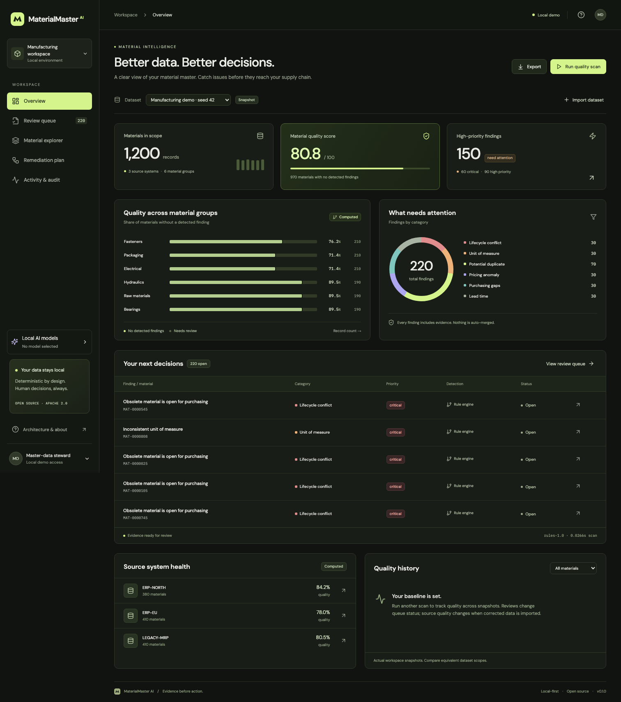
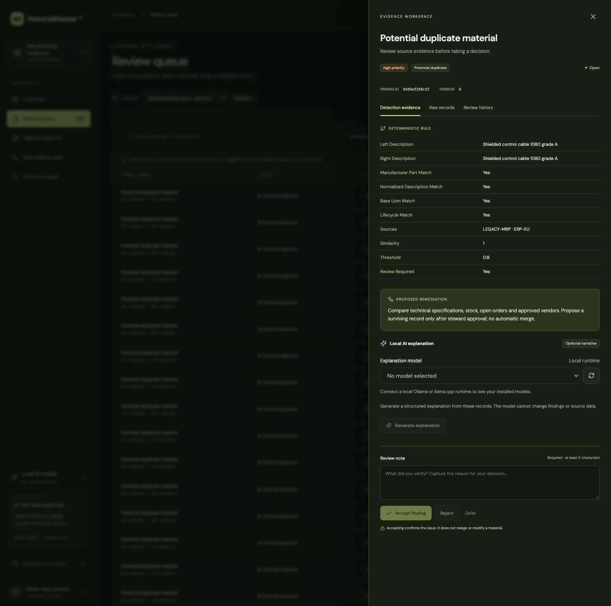
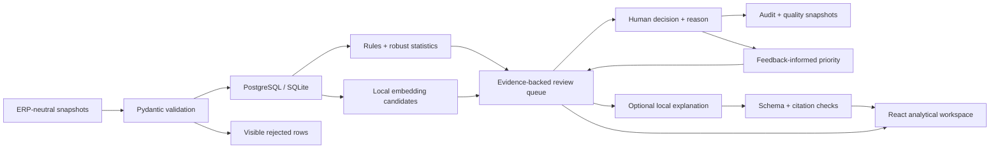
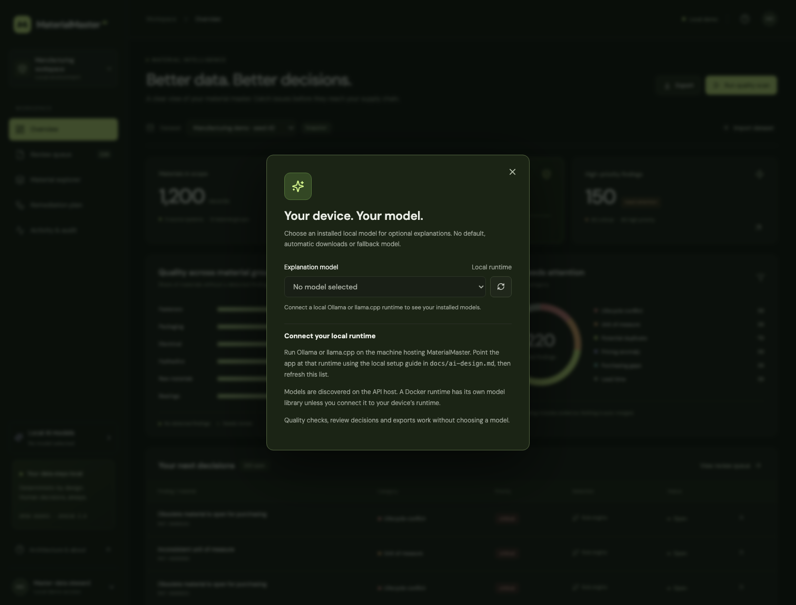

<div align="center">


# MaterialMaster AI

### Bad master data becomes an operational problem.<br/>Catch it before it becomes a purchase order.

An AI-assisted master-data quality guardian for ERP materials, pricing and purchasing records.

**Rules do the math. Models suggest. People decide.**

[](LICENSE)
[](docs/ai-design.md)
[](#run-it-locally)
[](docs/benchmarks/100k/summary.md)

[Quick start](#run-it-locally) · [Product walkthrough](#from-record-to-decision) · [Measured results](#measured-not-marketed) · [Architecture](#under-the-hood) · [Contribute](CONTRIBUTING.md)



*Real application. Synthetic records. Computed metrics. No dashboard placeholders.*

</div>

## The expensive mistake often starts with a cheap-looking field.

A buyer sees a price of **240**. Is that per piece, per box, or per ten boxes? A planner sees two descriptions for the same component. Is it a duplicate, or a different engineering specification? An obsolete material remains open for purchasing. Who should verify it, and where is the evidence?

MaterialMaster turns these questions into **reproducible checks, explainable findings and accountable review decisions**. Built for master-data stewards, procurement teams, supply planners and ERP product teams.

<table>
<tr><td width="33%"><strong>01 — Detect</strong><br/>Typed contracts, UOM checks, lifecycle rules, robust peer statistics and duplicate candidates.</td><td width="33%"><strong>02 — Understand</strong><br/>Raw records, source provenance, detection method and the exact evidence behind each finding.</td><td width="33%"><strong>03 — Decide</strong><br/>Accept, reject or defer with a reason. Export a proposed remediation plan. Preserve the audit trail.</td></tr>
</table>

## From record to decision

1. **Open the demo.** A deterministic 1,200-record snapshot loads on first start. No credentials or model download required.
2. **Inspect the overview.** Compare quality across material groups and source systems. All metrics come from the engine.
3. **Open the review queue.** Filter by issue type, status or material ID. See critical conflicts first.
4. **Review the evidence.** Compare raw source records, inspect unit conversions and price cohorts, and optionally request a local AI explanation.
5. **Record a decision.** A required note, optimistic concurrency control and an idempotency key keep decisions attributable and retry-safe.
6. **Propose remediation.** Route verified findings to the responsible role. Import a corrected snapshot to measure the next baseline.

> Accepting a finding does **not** merge materials, modify an ERP or artificially improve the quality score.

<details>
<summary><strong>See the evidence workspace</strong></summary>



</details>

## What it actually does

| Capability | Implementation |
|---|---|
| Exact duplicates | Canonical manufacturer/part IDs and description matching; known conflicting part numbers veto text-only candidates |
| Near duplicates | Bounded candidate blocks, local character embeddings by default, optional sentence-transformers semantic embeddings |
| Purchasing quality | Missing supplier, purchasing organization, lead time and price on active materials |
| UOM consistency | Dimension checks, standard unit conversions and explicit supplier pack factors |
| Price anomalies | Decimal normalization of price units/pack quantities, then median/MAD peer statistics within group, currency and base UOM |
| Lifecycle conflicts | Obsolete materials still available for purchasing; long lead-time review threshold |
| Human feedback | Latest duplicate decisions update Beta-prior acceptance estimates by detection method, adjusting review priority |
| Data lineage | Dataset ID, stable material ID, ingestion time, original fields, normalized fields, schema status and optional provenance |
| Quality history | Actual scan snapshots with group/source breakdowns; no simulated historical improvement |
| Bulk validation | REST and CLI; JSON, JSONL and CSV; malformed rows are reported and quarantined |
| Local explanations | Ollama / llama.cpp adapters, strict output schema, source citations, retries, failure telemetry and abstention |

## Run it locally

Prerequisites: Git and an **open-source Docker-compatible engine with Compose v2**. Docker Engine on Linux, or Colima/Lima with Docker CLI on macOS, are suitable options. Docker Desktop is not required. Initial image/package downloads require internet; the running default demo requires no AI service.

```bash
git clone <your-public-repository-url> materialmaster-ai
cd materialmaster-ai
cp .env.example .env
docker compose up --build
```

Open **[localhost:3000](http://localhost:3000)**. API reference: **[localhost:8120/docs](http://localhost:8120/docs)**.

The first run initializes PostgreSQL, imports a synthetic snapshot and scans it. Data persists in a named volume. Services bind to loopback. The default is an explicitly labeled local demo with AI narrative disabled.

**Validation status:** native backend, frontend build and browser checks are recorded in [the release checklist](docs/release-checklist.md). A Docker engine was unavailable on the build machine, so Compose startup and PostgreSQL execution remain release gates. The repository includes CI jobs that exercise both; a passing remote GitHub run has not been claimed.

### Native development

Python **3.12**, Node **24**, pnpm **11.25.0**. Python 3.11+ is supported by the package contract; the committed measurements use 3.12. See [macOS and Windows instructions](docs/development.md).

```bash
python3.12 -m venv .venv
source .venv/bin/activate
python -m pip install --upgrade 'pip>=26.2'
pip install -c requirements-lock.txt -e '.[dev]'
uvicorn apps.api.main:app --host 127.0.0.1 --port 8120
```

In another terminal:

```bash
cd apps/web
npm install -g pnpm@11.25.0
pnpm install --frozen-lockfile
pnpm dev
```

Open **[localhost:5178](http://localhost:5178)**. Native development uses SQLite WAL by default; Compose uses PostgreSQL with separate application and read-only roles.

## Bring your own snapshot—or generate 100,000 records

The committed sample is small enough to inspect. Ground truth lives in a **separate file** and never enters detection features.

```bash
# Fixed seed, intentional defects, stable IDs
materialmaster generate --count 100000 --seed 42 --output data/generated/100k

# Schema validation plus deterministic findings; writes a visible JSON report
materialmaster validate data/sample/materials.jsonl --analyze --output output/validation.json

# Persist large datasets through the CLI, without the browser upload limit
materialmaster import data/generated/100k/materials.jsonl --scan
```

Use **Import dataset** for browser uploads up to 20 MiB. Large generated snapshots should use the CLI. Schema-invalid rows remain available through the dataset validation endpoint. A completely malformed JSON/CSV envelope is rejected before a dataset is created; malformed individual JSONL lines are quarantined.

[Data dictionary](docs/data-model.md) · [JSON Schema](data/schemas/material.schema.json) · [Generator](src/materialmaster/domain/generator.py)

## API in one minute

```bash
# Read measured quality
curl http://localhost:8120/api/v1/overview

# Validate without importing or mutating anything
curl -X POST http://localhost:8120/api/v1/validate \
  -H 'Content-Type: application/json' \
  -d '{"records":[{"material_id":"M-1","source_system":"ERP-A","description":"Steel bolt 20 mm","material_group":"Fasteners","base_uom":"EA","order_uom":"BOX","order_to_base_factor":"100"}]}'

# Import; reusing this key with the same file returns the original result
curl -X POST http://localhost:8120/api/v1/commands/import \
  -H 'Idempotency-Key: my-import-0001' \
  -F 'file=@data/sample/materials.jsonl;type=application/x-ndjson'
```

Reads live under `/api/v1/*`; state-changing operations live under `/api/v1/commands/*`. Lists support bounded pagination. Reviews require a reason and `expected_version`. Errors share an `error.code`, `message` and `trace_id`. See [API conventions](docs/api.md).

## Under the hood

<!-- architecture-diagram -->


| Layer | Technology / boundary |
|---|---|
| Domain | Python, Pydantic, Decimal; pure quality rules and explicit statistical models |
| Similarity | scikit-learn / NumPy; optional sentence-transformers; no all-pairs matrix |
| Persistence | SQLAlchemy; PostgreSQL 17 in Compose; SQLite for native development |
| API | FastAPI, versioned REST, OpenAPI, authorization roles and transaction boundaries |
| Frontend | React, TypeScript, Vite, Radix Dialog, Lucide, locally bundled fonts |
| Optional AI | Ollama or llama.cpp, local open-weight models, structured outputs |
| Verification | pytest, Ruff, Vitest, ESLint, Playwright, pip-audit and pnpm audit |

Business logic lives outside route handlers and UI components. [Architecture](docs/architecture.md), [AI design](docs/ai-design.md) and [ADRs](docs/adr) explain the tradeoffs, including why this baseline does not require pgvector or Polars.

## Measured, not marketed

**100,000 synthetic records · seed 42 · macOS arm64 · 10 logical CPUs · Python 3.12.14 · LLM disabled.**

| Measurement | Actual result |
|---|---:|
| Duplicate pair precision | 100.00% |
| Duplicate pair recall | **77.76%** |
| UOM anomaly accuracy | 100.00% |
| Price anomaly precision | 100.00% |
| Material-level false-positive rate | 0.00% |
| Computational analysis | 1.2403 s |
| Generate + validate + analyze | 1.8705 s |
| Peak process RSS | 768.31 MiB |

These are **synthetic injection-recovery results**, not claims about customer data. There are **1,668 missed duplicate pairs**: the conservative lexical threshold misses some abbreviation variants without part-number anchors. The all-pairs duplicate accuracy is not a useful headline because negatives dominate; precision and recall are shown instead. Real deployment needs labeled ERP evaluation, supplier pack validation and calibrated peer groups.

The separate decision-write benchmark measured **500 committed reviews in 0.1719 s** using a single local SQLAlchemy client and SQLite WAL. This excludes HTTP, UI time and human reasoning. **Human review throughput has not been measured.**

```bash
materialmaster benchmark --count 100000 --seed 42 --output output/benchmark
python scripts/review_throughput.py
```

Each evaluation writes JSON, CSV and a Markdown summary with hardware, model configuration and algorithm parameters. [Raw 100k result](docs/benchmarks/100k/result.json) · [CSV](docs/benchmarks/100k/metrics.csv) · [Methodology](docs/evaluation.md) · [Decision-write result](docs/benchmarks/review-throughput.json).

## Where does workplace data come from?

**Your ERP or purchasing system is the source of truth.** Export your material/item master, purchasing records, unit conversions and purchase prices; map the columns; then import CSV, JSON or JSONL. A governed warehouse extract or a steward-managed spreadsheet saved as CSV also works.

The demo is synthetic. SAP, Oracle, Dynamics and Odoo can be upstream systems **through exports you prepare**; this release does not bundle native ERP connectors or write back changes. Keep one purchasing context per material in each snapshot.

[**Start with the CSV template →**](data/sample/import-template.csv) · [**Workplace source & field-mapping guide →**](docs/data-sources.md)

## Optional local AI

**Your device. Your model. No default.** Open **Local AI models** in the sidebar or the model selector in a finding. Choose an installed model explicitly before generating an explanation. Even a single installed model is never preselected. Selection lasts for the browser session; a reload clears it. Quality checks work with no model selected.

For an existing Ollama installation on your device, configure the API runtime in `.env`:

```dotenv
LLM_RUNTIME=ollama
# Docker API → the runtime on your Mac/Windows host:
LLM_URL=http://host.docker.internal:11434
# Native API on the same machine: use http://localhost:11434 instead.
```

Restart the API, then **Refresh local models** and choose from your installed models. For a containerized runtime, enable the optional `ai` Compose profile and use `http://ollama:11434`; that container has its own model library. No model is automatically downloaded, selected or used as a fallback. Cloud-backed Ollama aliases are excluded and metadata is verified before inference.

Ollama and llama.cpp are supported. You choose and license the weights; models need text completion and structured-output support. Semantic embeddings are separately opt-in with your local model path. Model weights are not included. [Complete local setup, Docker/Linux details and model benchmarking](docs/ai-design.md).

Explanations expose citations and observable telemetry, never private chain-of-thought. Unknown citations, missing evidence, timeouts or schema failures return abstention. The explanation service has **no write tools, shell access or model-generated SQL**.



## Trust boundaries and honest limitations

- **Local demo access is not production identity.** Token mode separates read and steward permissions. Add organization identity, rate limits, backups and deployment controls before sharing beyond localhost.
- **A finding is not ground truth.** Peer groups can mix commercial grades; currencies are never converted. No contract effective-date or tier-price model yet.
- **Candidate blocking can miss duplicates.** Blocks over 80 records are capped and explicitly reported. Lexical embeddings are labeled lexical, not semantic AI.
- **One purchasing context per material row.** The schema flattens an ERP material plus a purchasing info-record context. It does not model a full many-vendor/plant ERP hierarchy.
- **Accepted decisions do not repair data.** Feedback changes suggestion priority only. There is no auto-merge or ERP write-back.
- **Bounded local reference, not a distributed platform.** Scans are synchronous; imports and scans are in memory. Findings search/priority currently loads one snapshot's findings before paginating.
- **Quality score denominator is schema-valid material rows.** Invalid records are reported separately. Compare trends only for equivalent dataset scope.
- **Version 0.1 initializes a fresh schema.** Controlled database migrations, independent per-user identities and tamper-evident audit storage are future work.
- Docker/PostgreSQL and live optional model execution were not verified on the authoring machine. CI is supplied, not represented as already passing on GitHub.

[Threat model](docs/security.md) · [Security reporting](SECURITY.md) · [Open-source licenses](docs/open-source-licenses.md).

## Built to be examined

```bash
ruff check src apps/api tests scripts
pytest --cov=materialmaster --cov=apps.api
cd apps/web
pnpm lint && pnpm typecheck && pnpm test && pnpm build
pnpm exec playwright install chromium
pnpm test:e2e
```

Tests cover numeric/unit boundaries, candidate guardrails, malformed data, fixed seeds, missing evidence, model failures, authorization, idempotency, stale-review conflicts, audit records and a real browser workflow. GitHub Actions adds PostgreSQL integration, Compose smoke tests and dependency checks. [Screenshot reproduction](docs/screenshots.md) · [Release checklist](docs/release-checklist.md) · [Complete repository map](docs/repository-tree.md).

## Where this goes next

1. **Evaluate semantic embeddings on a held-out ERP-like corpus**, including abbreviations, cross-language descriptions and engineering-spec hard negatives.
2. **Add asynchronous, restartable ingestion and scan jobs** with bounded memory, cancellation and incremental updates.
3. **Model purchasing info records separately**, including vendor, plant, validity intervals, tier pricing and approved UOM mappings.
4. **Add controlled schema migrations and OIDC identities**, with retention policies and independently verifiable audit exports.
5. **Move large candidate retrieval to pgvector**, with measured recall/latency tradeoffs and persisted model/version fingerprints.

See [the roadmap](docs/roadmap.md). Stretch features do not replace core correctness.

## Make it better

Contributions that improve **a specific purchasing outcome, a falsifiable quality rule or a reproducible evaluation** are especially welcome. Start with [CONTRIBUTING.md](CONTRIBUTING.md), use synthetic examples and include the before/after evidence. Please follow the [Code of Conduct](CODE_OF_CONDUCT.md).

Licensed under **Apache-2.0**. Dependencies retain their own licenses; fonts use OFL, PostgreSQL its own permissive license and Psycopg LGPL-3.0. [Dependency notes](docs/open-source-licenses.md) and the [installed package inventory](docs/dependency-inventory.json) document these boundaries.

<div align="center">

**Evidence before action.**<br/>
If this helps your team, share a reproducible use case—or contribute the edge case that breaks it.

</div>
